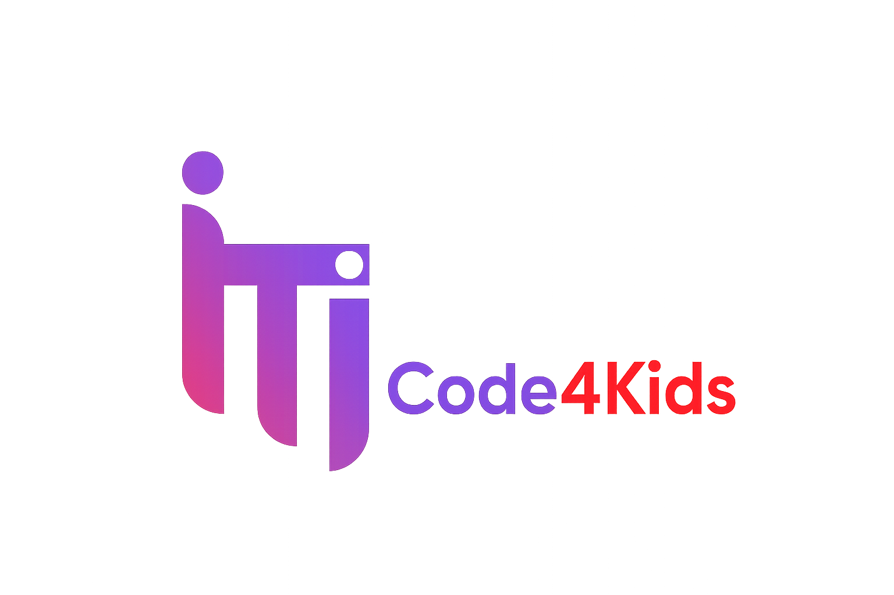

# Code4Kids - Backend


<div align="center">
  
</div>

## Features

A user registration and learning management system built with Django REST Framework and JWT Authentication.

- User Registration with username, email, password, and Egyptian phone number validation
- Role-based authentication for Kid, Parent, Admin, and Instructor
- JWT token generation for secure access
- Course management system with CRUD operations
- Lesson creation and management with media upload support
- Assignment submission and grading system
- Progress tracking for students and parents
- Role-based access control for different user types

## Installation Guide

```bash
# Clone the repository
git clone https://github.com/USERNAME/REPO_NAME.git
cd REPO_NAME

# Create and activate a virtual environment
python -m venv venv
source venv/bin/activate        # On Windows: venv\Scripts\activate

# Install dependencies
pip install -r requirements.txt

# Apply database migrations
python manage.py migrate

# Start the development server
python manage.py runserver
```

## API Endpoints

### Authentication & User Management

| Method | Endpoint | Description |
| ------ | -------- | ----------- |
| POST | `/api/accounts/register/` | Register a new user |
| POST | `/api/accounts/login/` | Login and get JWT tokens |
| GET | `/api/accounts/profile/` | Get user profile |
| GET | `/api/accounts/parent-only/` | Parent Dashboard |
| GET | `/api/accounts/kid-only/` | Kid Zone |
| GET | `/api/accounts/admin-only/` | Admin Panel |
| GET | `/api/accounts/instructor-only/` | Instructor Dashboard |

### Instructor Management

| Method | Endpoint | Description |
| ------ | -------- | ----------- |
| GET | `/api/accounts/instructors/` | List all instructors |
| PUT | `/api/accounts/instructor/profile/` | Update instructor profile |

### Course Management

| Method | Endpoint | Description |
| ------ | -------- | ----------- |
| POST | `/api/courses/` | Create a new course |
| GET | `/api/courses/` | Get all courses |
| GET | `/api/courses/<id>/` | Get specific course |
| PUT | `/api/courses/<id>/` | Update specific course |
| DELETE | `/api/courses/<id>/` | Delete specific course |
| GET | `/api/categories/` | Get all categories |
| POST | `/api/enroll/` | Enroll in a course |
| GET | `/api/my-enrollments/` | Get user enrollments |

### Lesson Management

| Method | Endpoint | Description |
| ------ | -------- | ----------- |
| POST | `/api/lessons/` | Create a new lesson |
| GET | `/api/lessons/` | Get all lessons |
| GET | `/api/lessons/<int:pk>/` | Get specific lesson details |
| PUT | `/api/lessons/<int:pk>/` | Update a specific lesson |
| DELETE | `/api/lessons/<int:pk>/` | Delete a specific lesson |

### Assignments & Submissions

| Method | Endpoint | Description |
| ------ | -------- | ----------- |
| GET | `/lessons/<lesson_id>/assignments/` | Get lesson assignments |
| POST | `/submissions/create/` | Submit an assignment |
| PATCH | `/submissions/<submission_id>/grade/` | Grade a submission |
| POST | `/upload/` | Upload media files |

### Progress Tracking

| Method | Endpoint | Description |
| ------ | -------- | ----------- |
| GET | `/progress/parent/` | Get children's progress |
| GET | `/progress/admin/` | Get all progress data |